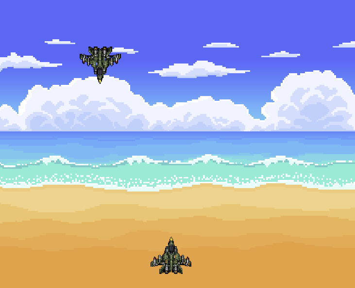
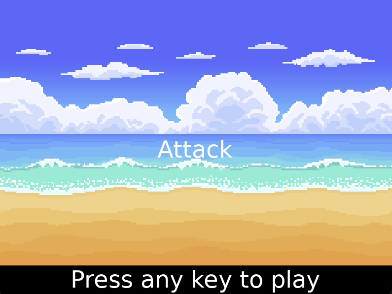
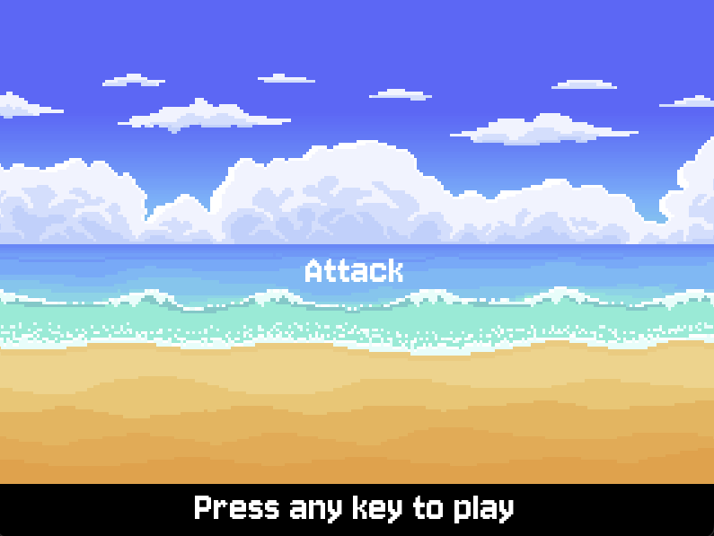
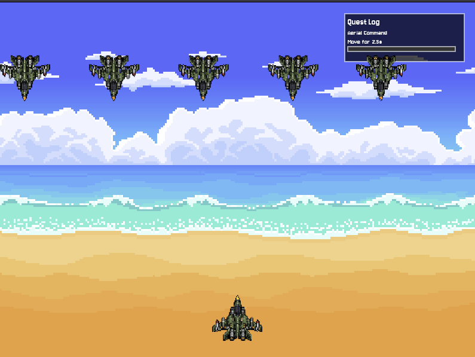

# Days Prior to Kickoff Call:

I began the project and I started with a 3D cube in Love**2D** (emphasis on 2D), and while it was impressive, it barely ran at 30fps. It didn't seem feasible to me so I decided to not do it. I also made a small isometric ground prototype but it would crash frequently. 

I then scrolled through itch.io and found some art I liked, one from a roguelite style game (I didn't end up using it) and a platformer which I ended up using for the background.

So I intergrated the background, using a parallax effect and it looked kinda cool. Still no gameplay, but what could I make using this base?

Decisions, decisions, decisions. What about a shmup? (Shoot 'em up), I added a player, some enemies and movement, you could shoot them in one shot and kill them.

# Day 1

I increased the enemies to 4 (instead of 3) and fixed a bug where you can't kill the final enemy!

 

Here's a screenshot of what I have at the start of today, the player looks decent but the enemy uses the same sprite which looks weird

I quickly edited the enemy fighter to be orange so it doesn't look as jarring, it's not my finest work but it's good for now.

The system for enemy movement was redid, it feels better but its also feeling very slow. I'm just not sure how to make it feel right not gonna lie.

Here's a simple main menu that uses sky.png, its really simple and doesn't look great but it works simply usign a type to play method (or buttons once they come)

This uses a nice pixel font I found (pixelify sans) from Google Fonts which makes it look a tad better but still not what I was hoping for.

# Day 2 

I added a quest log feature with currently only one quest, I'm gonna work on the next one after I push this, and it aims to make you familar with movement (maybe the next one will be shooting enemys I think).